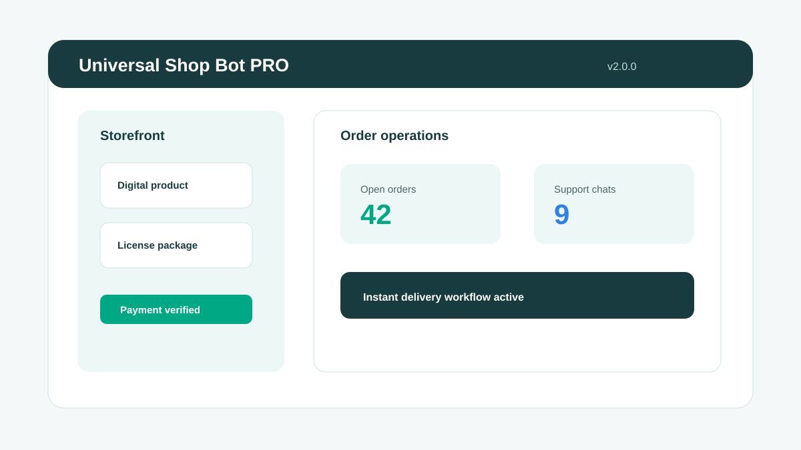

# Universal Shop Bot PRO v2.0

Automated digital storefront bot for Telegram with product management, customer support workflows, and payment verification.

## Preview

## Features

- Digital product catalog and inventory management
- Automated delivery after verified purchase
- Customer support assistant integration
- Payment and wallet verification workflows
- Order tracking and fulfillment status
- Multi-language storefront support

## Download

Latest version: 2.0.0

[Download Universal-Shop-Bot-PRO-2.0.0.exe](https://github.com/anoop14613742/universal-shop-bot-pro/releases/download/v2.0.0/Universal-Shop-Bot-PRO-2.0.0.exe)

System requirements:

- Windows 10 or newer for the packaged desktop build
- Python 3.10+ for manual deployment
- PostgreSQL or SQLite for production deployments
- Telegram Bot Token
- Required API keys for enabled integrations

## Quick Start

1. Download the packaged build or deploy from source.
2. Create a Telegram bot token with [@BotFather](https://t.me/BotFather).
3. Configure products, payment settings, and support messages.
4. Add required API keys through your deployment environment.
5. Start accepting authorized customer orders.

## Documentation

- [Installation Guide](https://telepilotpro.com/docs/universal-shop-bot-pro/installation)
- [Configuration](https://telepilotpro.com/docs/universal-shop-bot-pro/config)
- [API Reference](https://telepilotpro.com/docs/universal-shop-bot-pro/api)
- [Deployment](https://telepilotpro.com/docs/universal-shop-bot-pro/deployment)

## Support

- Email: support@telepilotpro.com
- Telegram: [@TelePilotPro](https://t.me/TelePilotPro)

## Pricing

Universal Shop Bot PRO is commercial software for Telegram storefront operators.

[Buy now](https://telepilotpro.com/pricing)

## License

Commercial Software - see [LICENSE](./LICENSE).

Copyright (c) 2026 TelePilot Pro.
